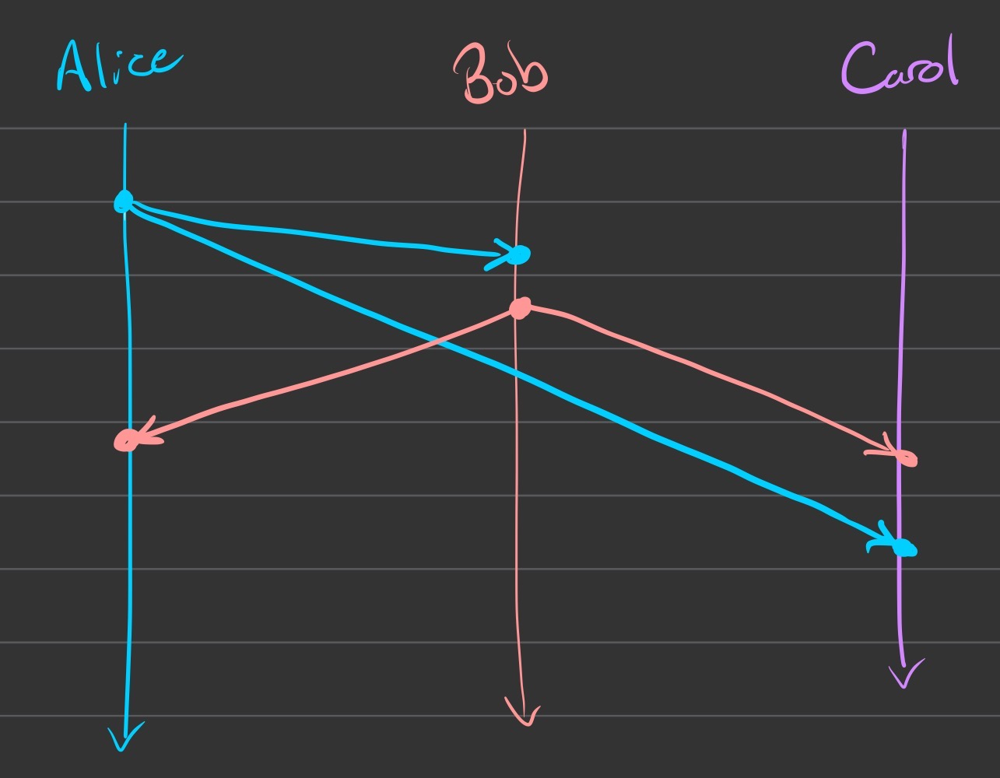
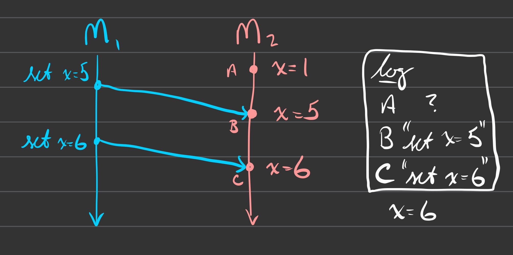

# Time & Clocks

What do we use clocks for?
- scheduling: marking points in time
- durations/intervals

Two different types of clocks in computer systems
- time of day clocks
    - can be synchronized between machines (using NTP)
    - can jump forward or backward
    - [cloudflare's leap second bug](https://blog.cloudflare.com/how-and-why-the-leap-second-affected-cloudflare-dns/)
- monotonic clocks
    - only goes forward
    - only meaningful on a specific machine
    - **not comparable between machines**

| physical clocks    | points in time | intervals/durations |
|--------------------|----------------|---------------------|
| time-of-day clocks | :(             | :)                  |
| monotonic clocks   | :(             | :(                  |

<table>
    <tr>
        <th>physical clocks</th>
        <th>points in time</th>
        <th>intervals/durations</th>
    </tr>
    <tr>
        <td>time-of-day clocks</td>
        <td>:(</td>
        <td>:)</td>
    </tr>
    <tr>
        <td>monotonic clocks</td>
        <td>:(</td>
        <td>:(</td>
    </tr>
</table>

Since these both suck, what can we do?

{:.def term="Logical Clock"}
A clock that only measures the **order of events**.

\\(A \rightarrow B\\)
- "\\(A\\) happened before \\(B\\)"
- notion of *causality*
    - \\(A\\) *could have* (but may not have) caused \\(B\\)
    - \\(B\\) *could **not** have* caused \\(A\\)

## Lamport Diagrams
Also known as "spacetime diagrams"

Example:

## Network Models
A **synchronous network** is one where there exists some \\(n\\) such that no messages takes
longer than \\(n\\) units of time to be delivered.
**we're done talking about synchronous networks forever!**
- however there are interesting "partially synchronous" networks

{:.def term="Asynchronous Network"}
A network where there exists **NO** \\(n\\) such that no message takes
longer than \\(n\\) units of time to be delivered.

## Happens-Before Relationship (\\(\rightarrow\\))
Given events A and B, we say A \\(\rightarrow\\) B if:
- A and B occur on the same process with A before B
- A is a `send` event and B is the corresponding `receive` event
- if A \\(\rightarrow\\) B and B \\(\rightarrow\\) C, then A \\(\rightarrow\\) C

If two events don't share a happens-before relationship, then the events
are said to be "concurrent".
- there's no common notion of time between processes, so as far as we're
  able to tell the events are *effectively* simultaneous.

## State and Events

Consider the following diagram:

Knowing the only messages sent were `set x=5` and `set x=6`, can you say
the final state of x is \\(x = 6\\)?
- **yep!**

Knowing \\(x = 6\\) is the final state, can you recover the messages `set
x=5` and `set x=6`?
- **nope!**

You can determine state from a full event history, but the reverse is
not true.
